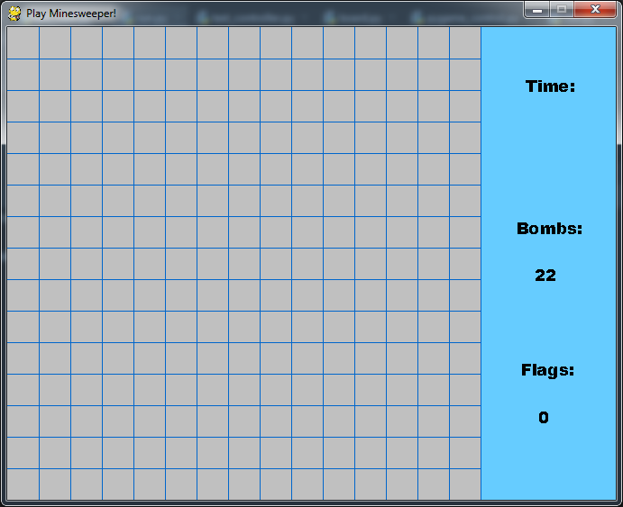
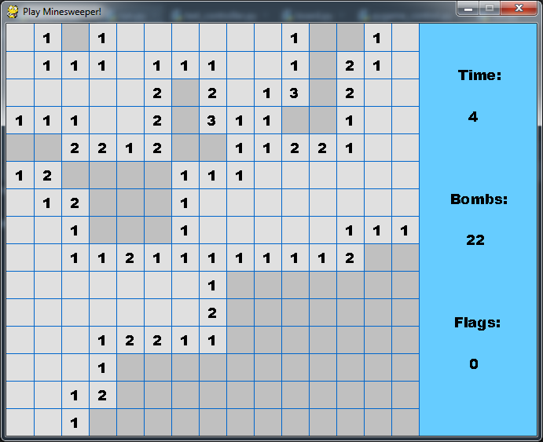
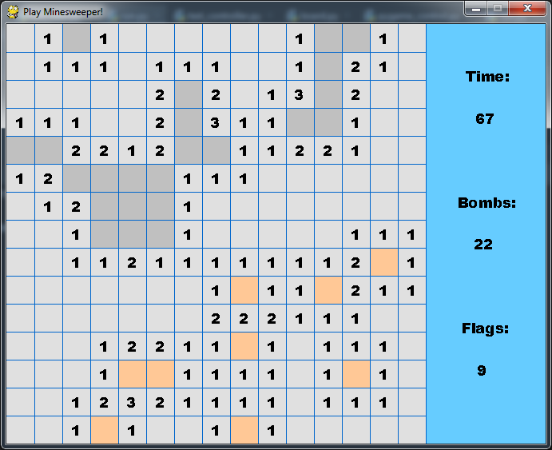
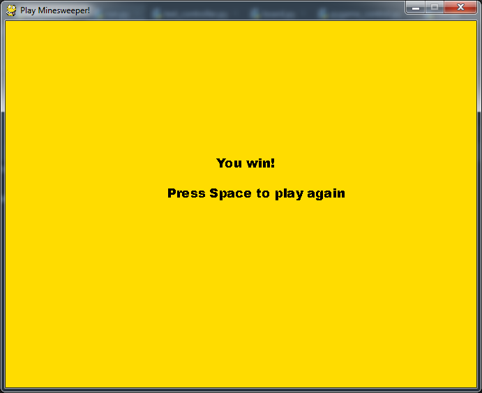
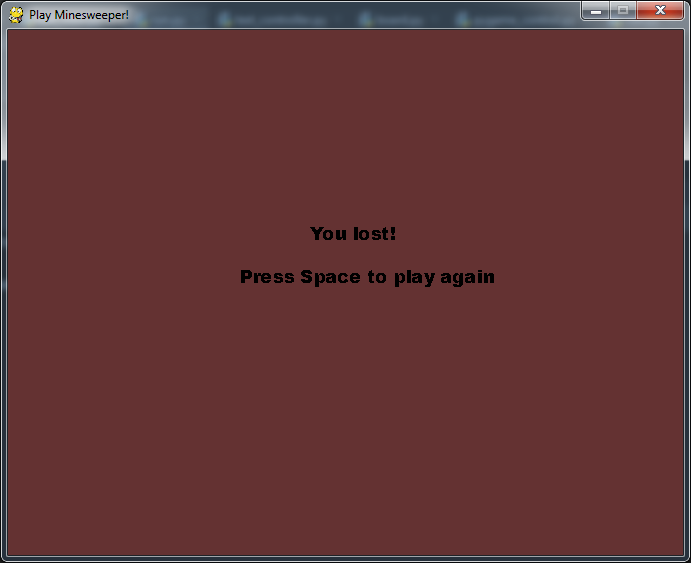

# MINESWEEPER

**[pygame Required]**

## Abstract 
View below is the original look of the project 

First bigger project in Python worth uploading. 
A much simpler in design Minesweeper than the [previous one](https://github.com/adinsoon/Minesweeper_cpp), just to mark my first steps and basic skills of using Python and pygame library. 

## Description 
The project consist of:
  * ~~interactive menu:~~
    - ~~game mode selection:~~ I made it [here](https://github.com/adinsoon/Minesweeper_cpp) so to save time the game mode selection is done in the run.py file
    ```python
     # available to change but it will also affect the size of the window and difficulty level!
     # difficulty levels - "EASY", "NORMAL", "HARD"
     board = Board(15, 15, "EASY")
    ```
  * game window:
    - compared to the [c++ version](https://github.com/adinsoon/Minesweeper_cpp), I added basic UI that shows time, bombs on the board and toggled flags. 
  * message:
    - a message suited to the result of the game
    
The game doesn't include soundtracks.
    
## Pictures of the game






